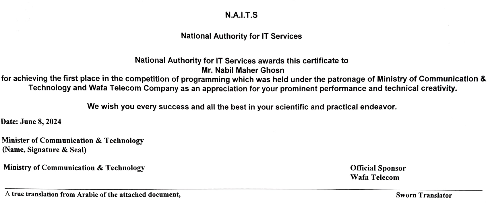

# 🍃 Fruitful Tree Count Management

AI-powered system for detecting and counting fruit trees from satellite imagery, with integrated farm management and change detection services.

---

## 📜 Overview

Developed as my 2023 graduation project, this system automates fruit tree detection and counting using **GeoDjango**, **RESTful APIs**, **Leaflet.js**, and **OpenCV**.
It improves agricultural efficiency, reduces costs compared to traditional methods, and provides actionable insights to boost national income.

🏆 **Achievements:**

- **88% grade** in graduation evaluation.
- **1st place** in the National Programming Competition.
- Recognized by the **National Authority for IT Services**, **Ministry of Communication & Technology**, and **Wafa Telecom Company**.

---

## 🏅 Certification

**English Certificate (translated)**


**Original Arabic Certificate:**  
[Click to view](assets/certificate-ar.jpg)

---

## 📸 Visual Demonstrations

Screenshots and visual walkthroughs of the system — including tree detection results, farm management dashboard, and change detection maps — are available in the project presentation:

👉 [View Project Presentation (PPTX)](assets\project-presentation.pptx)

This presentation provides a structured overview of the system’s core functionalities, UI components, and technical architecture.

---

## 🚀 Features

- **AI Tree Detection** – Spectral signature recognition for template matching (high accuracy, low cost).
- **Farm Management Dashboard** – Manage plots, monitor changes, and generate reports.
- **Change Detection** – Google Earth Engine integration for environmental monitoring.
- **Local Deployment** – Monolithic Django architecture for easy maintenance.

---

## 🛠 Tech Stack

- **Backend:** Django, GeoDjango, REST Framework
- **Frontend:** Leaflet.js, HTML/CSS/JS
- **AI/Computer Vision:** OpenCV
- **Geospatial Analysis:** Google Earth Engine
- **Database:** PostgreSQL + PostGIS

---

## 📂 Project Structure

```plaintext
Fruitful-Tree-Count-Management/
│
├── assets/         # Images, certificates, and visuals
├── changedet/      # Change Detection and Analysis System
├── farms/          # Farms Management System
├── templates/      # HTML Django Template pages
├── statics/        # Leaflet.js maps, Javascript, CSS, and UI elements
└── README.md
```

---

## 👥 Team

- Nabil Ghosn – Full-stack system design, AI deployment
- Mostafa Al Rahal – AI algorithm development & evaluation
- Wissam Zoudi – Change detection algorithms (GEE)
- Yhya Altroudi – GEE production integration, backend collaboration

---

## 📚 Documentation

- [Project Report (Arabic PDF)](assets/project-report-ar.pdf)  
  Detailed technical write-up covering methodology, architecture, and user guidance.

---

## 🔗 Links

- [LinkedIn Project Post](https://www.linkedin.com/posts/nabil-ghosn_ai-agritech-innovation-activity-7268596532893941760-49ia/)
